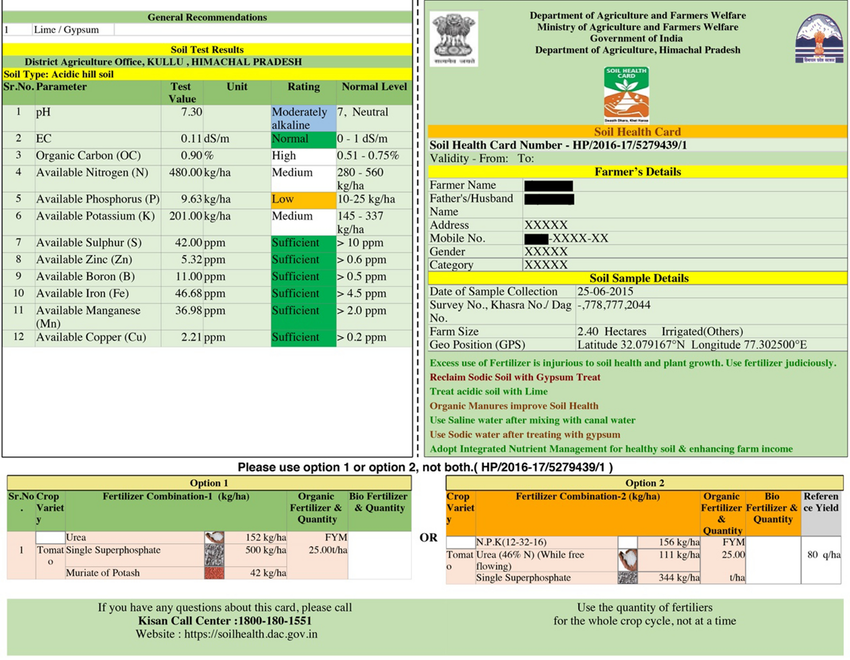

# Soil Health Card — Conversational Consultation System

A voice-first web application that helps Indian farmers understand their Soil Health Cards (SHC) through real-time, dialect-aware conversations in their own language.

**Live Demo:** [shc-app-two.vercel.app](https://shc-app-two.vercel.app)



---

## The Problem

The Government of India has issued **22 crore+ Soil Health Cards** to farmers across the country — each containing soil nutrient data and fertilizer recommendations specific to the farmer's plot. However, an [IDinsight RCT (2021)](https://www.idinsight.org/project/improving-indias-soil-health-card-scheme-and-agricultural-markets/) found that **67% of farmers cannot understand their Soil Health Card**, even after the government redesigned the card format. Generic audio explanations were proven ineffective. What works is **card-specific, dialect-specific, conversational explanation**.

This application bridges that gap.

---

## How It Works

The system operates in **three phases**, designed to be used by a CSC (Common Service Centre) operator assisting a farmer:

### Phase 1: Intake
The operator selects:
- **Language + dialect** (Hindi, Bhojpuri, Marathi, Telugu, Kannada, Tamil, Bengali, Gujarati, etc.)
- **Fertilizer type** (DAP or SSP)
- **State and crop** (state-specific crop dropdown)

Then uploads a photo of the farmer's Soil Health Card.

### Phase 2: Extraction Pipeline
1. **Vision OCR** (Groq Llama 4 Scout) — reads the card image and extracts all text, tables, and values
2. **SHC Validation** — keyword matching to ensure the uploaded image is actually an SHC
3. **Structured Extraction** (Groq LLM) — parses OCR text into a structured Session Context JSON with all 12 soil parameters, fertilizer recommendations, and farmer details
4. **Normalization** — converts per-holding quantities to per-acre, handles unit differences across states (Decimal, Acre, Hectare, Guntha, Cent)
5. **Deficiency Prioritization** — ranks soil deficiencies by crop relevance

### Phase 3: Voice Consultation
1. **Opening Summary** — deterministic, template-based (not LLM) summary in the farmer's language: top deficiencies, per-acre fertilizer quantities, invitation to ask questions
2. **Conversation Loop** — Farmer speaks → Sarvam STT → LLM (grounded in Session Context) → Sarvam TTS → repeat
3. **Guardrails** — jailbreak detection on input, scope/contradiction/safety validation on output
4. **Auto-end detection** — recognizes when the farmer says goodbye and gracefully ends the session

---

## Architecture

```
┌─────────────┐     ┌──────────────┐     ┌─────────────────┐
│  Intake UI  │────>│  /api/extract │────>│  Session Context │
│  (React)    │     │  Vision + LLM │     │  JSON            │
└─────────────┘     └──────────────┘     └────────┬────────┘
                                                   │
┌─────────────┐     ┌──────────────┐               │
│ Consultation│<--->│  /api/respond │<──────────────┘
│ Voice UI    │     │  STT+LLM+TTS │
└─────────────┘     └──────────────┘
```

### API Routes

| Route | Purpose |
|-------|---------|
| `POST /api/extract` | Upload SHC image → OCR → structured extraction → Session Context |
| `POST /api/respond` | Voice/text input → STT → LLM → TTS → binary stream response (also handles opening message via `speak_only` flag) |
| `POST /api/session` | Retrieve session context by ID |

### Binary Streaming Protocol

The `/api/respond` endpoint streams interleaved text and audio chunks for progressive playback:

```
[type: 1 byte][length: 4-byte big-endian uint32][data bytes]
```
- `0x01` = audio chunk (WAV)
- `0x02` = text chunk (UTF-8)

TTS calls fire in parallel for all sentences; results stream back in order for lowest latency.

---

## Tech Stack

| Layer | Technology |
|-------|-----------|
| **Framework** | Next.js 16 (App Router) |
| **Frontend** | React 19, Tailwind CSS 4 |
| **Vision OCR** | Groq — Llama 4 Scout 17B (multimodal) |
| **LLM Extraction** | Groq — Llama 3.3 70B (JSON mode) |
| **LLM Conversation** | Sarvam AI — sarvam-30b (Indic-optimized) |
| **Text-to-Speech** | Sarvam AI — Bulbul v3 |
| **Speech-to-Text** | Sarvam AI — Saarika v2.5 |
| **Deployment** | Vercel (serverless) |

---

## Supported Languages

| Language | Dialect | Code |
|----------|---------|------|
| Hindi | Standard | hi-IN |
| Hindi | Bhojpuri | bho-IN |
| Hindi | Awadhi | hi-IN |
| Marathi | Standard | mr-IN |
| Telugu | Standard | te-IN |
| Telugu | Telangana | te-IN |
| Kannada | Standard | kn-IN |
| Tamil | Standard | ta-IN |
| Bengali | Standard | bn-IN |
| Gujarati | Standard | gu-IN |

---

## Getting Started

### Prerequisites
- Node.js 18+
- npm

### 1. Clone and install

```bash
git clone https://github.com/arhambrrr/soil-health-card-consultation.git
cd soil-health-card-consultation
npm install
```

### 2. Set up environment variables

```bash
cp .env.example .env
```

Edit `.env` with your API keys:

```env
# Sarvam AI — LLM conversation, TTS, STT
SARVAM_API_KEY=your_sarvam_api_key

# Groq — Vision OCR and structured extraction
GROQ_API_KEY=your_groq_api_key
```

- **Sarvam AI**: Sign up at [sarvam.ai](https://sarvam.ai) to get an API key
- **Groq**: Sign up at [console.groq.com](https://console.groq.com) to get an API key

### 3. Run locally

```bash
npm run dev
```

Open [http://localhost:3000](http://localhost:3000).

### 4. Deploy to Vercel

```bash
npm i -g vercel
vercel --prod
```

Set `SARVAM_API_KEY` and `GROQ_API_KEY` in your Vercel project's Environment Variables settings.

---

## Project Structure

```
├── app/
│   ├── page.tsx                  # Language picker (entry point)
│   ├── layout.tsx                # Root layout
│   ├── session/[id]/page.tsx     # Intake form + consultation flow
│   └── api/
│       ├── extract/route.ts      # Vision OCR → LLM extraction → Session Context
│       ├── respond/route.ts      # STT → LLM → TTS streaming pipeline
│       └── session/route.ts      # Session retrieval
├── components/
│   ├── LanguagePicker.tsx        # Language + dialect selection grid
│   ├── IntakeForm.tsx            # State/crop/fertilizer form + image upload
│   ├── ConsultationUI.tsx        # Voice consultation interface
│   ├── ExtractionProgress.tsx    # Loading states during extraction
│   ├── PushToTalkButton.tsx      # Microphone recording button
│   └── TranscriptPanel.tsx       # Conversation transcript display
├── lib/
│   ├── sarvam.ts                 # API clients (Groq Vision, Sarvam LLM/TTS/STT)
│   ├── system-prompt.ts          # LLM system prompt with agronomic knowledge base
│   ├── i18n.ts                   # Multilingual UI strings + opening templates
│   ├── guardrails.ts             # Input sanitization + output validation
│   ├── normalization.ts          # Unit conversion (Decimal/Guntha/Hectare → Acre)
│   └── session.ts                # In-memory session store
├── types/
│   └── session.ts                # SessionContext TypeScript types
├── tests/
│   └── test-guardrails.ts        # Guardrail test suite (58 tests)
└── public/
    └── demo-shc.png              # Demo SHC image for testing
```

---

## LLM Guardrails

The system enforces strict guardrails for safe, accurate agricultural advice:

**Input guardrails:**
- Jailbreak/prompt injection detection (regex + keyword matching)
- Blocked inputs return a canned deflection in the farmer's language

**Output guardrails:**
- **Scope enforcement** — only answers questions grounded in the Session Context
- **3-sentence limit** — voice output must be concise
- **Unit enforcement** — never say bare numbers, always include units ("93 kilo urea")
- **No contradiction** — responses cannot contradict card values
- **Safe limits** — flags if farmer wants to over-apply fertilizer
- **Deflection** — out-of-scope questions (pests, market prices) are redirected to the Krishi Sewak
- **Auto-end** — detects farmer goodbye intent and ends session gracefully

---

## SHC Card Format Support

| Format | Era | Characteristics |
|--------|-----|-----------------|
| **New** | Post-April 2023 | Foldable, color-coded, recommendations in kg/acre |
| **Old** | Pre-2023 | Single large page, dual Anushansa columns (DAP/SSP), recommendations per-holding |

The extraction pipeline handles both formats automatically, including:
- Format detection
- Dual Anushansa column parsing (old cards)
- Per-holding → per-acre normalization
- Micronutrient range midpoint calculation
- State-specific unit conversion

---

## Key Design Decisions

1. **Template-based opening** — The first message is deterministic (not LLM-generated) to ensure accuracy and speed
2. **Parallel TTS** — All sentences are sent to TTS simultaneously, then streamed in order for minimum latency
3. **Client-side image compression** — Images are resized to max 1200px and converted to JPEG before upload
4. **Tap-to-start gate** — Handles browser AudioContext autoplay policy by requiring a user gesture before audio playback
5. **Client-side session storage** — Works around Vercel Lambda memory isolation (each API route runs in a separate Lambda)
6. **Groq for extraction, Sarvam for conversation** — Groq provides fast synchronous vision OCR; Sarvam provides Indic-optimized LLM conversation

---

## Environment Variables

| Variable | Required | Used For |
|----------|----------|----------|
| `SARVAM_API_KEY` | Yes | Sarvam LLM (conversation), Bulbul TTS, Saarika STT |
| `GROQ_API_KEY` | Yes | Groq Llama 4 Scout (Vision OCR), Llama 3.3 70B (extraction) |

---

## License

MIT

---

## Acknowledgements

- [Sarvam AI](https://sarvam.ai) — Indic-optimized LLM, TTS (Bulbul v3), and STT (Saarika v2.5)
- [Groq](https://groq.com) — Fast inference for Llama 4 Scout (vision) and Llama 3.3 70B (extraction)
- [IDinsight](https://www.idinsight.org) — Research establishing the 67% comprehension gap in SHC understanding
- Government of India, Ministry of Agriculture — Soil Health Card Scheme
